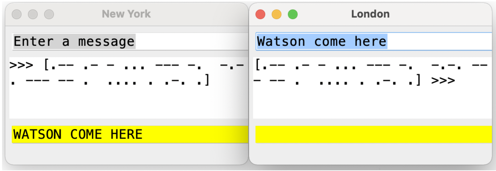

Morse Code  Lab- from Maria and Gary Litvin "Java Methods" 

In 1858 Queen Victoria sent the first transatlantic telegram of ninety-eight words to congratulate President James Buchanan of the United States. The telegram started a new era of "instant" messaging – it took only sixteen and a half hours to transmit via the brand new transatlantic telegraph cable.

In this project, we will simulate a telegraph station that encodes messages from text to Morse code and decodes Morse code back to plain text.  The encoding is accomplished simply by looking up a symbol in a **<code>TreeMap&lt;Character, String></code></strong> that associates each symbol with its Morse code string. Spaces are inserted between each morse code letter to signify the end of the letter. (These spaces are equivalent to the pause that is done between letters during transmission.) Spaces between words are simply passed through as spaces when encoding. The decoding is implemented with the help of a binary "decoding" tree of our own design (it is not a BST). The Morse code for each letter represents a path from the root of the tree to some node: "DOT" means go left, and "DASH" means go right. The node at the end of the path contains the symbol corresponding to the code. Intermediate nodes can simply be set to a space character. To help you visualize the decoding tree that you constructed, the <code>BTreePrinter</code> inner class is provided. The static <code>  </code> method will print your decoding tree in a graphical representation.

The _Telegraph_ program is implemented in two classes: `Telegraph `and `MorseCode`. In addition, `MorseCode `uses the TreeNode class. The Telegraph class opens two windows on the screen, "London" and "New York", and handles the text entry fields and GUI events in them. We have written this class for you. The `MorseCode` class implements encoding and decoding of text. All the methods in this class are static. The start method initializes the encoding map and the decoding tree; the private method `treeInsert` inserts a given symbol into the decoding tree, according to its Morse code string; the public `encode` and `decode` methods convert plain text into Morse code and back, respectively. Your task is to supply all the missing code in the `MorseCode` class.

Here is a screenshot of a working version of the program:

Required:

* commit to GitHub frequently, at least daily, with a meaningful commit message
* submit your link to the completed code in GitHub via a Canvas assignment
* show me a running example of program

Extension:

* add more awesome

